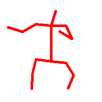
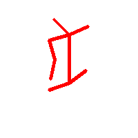
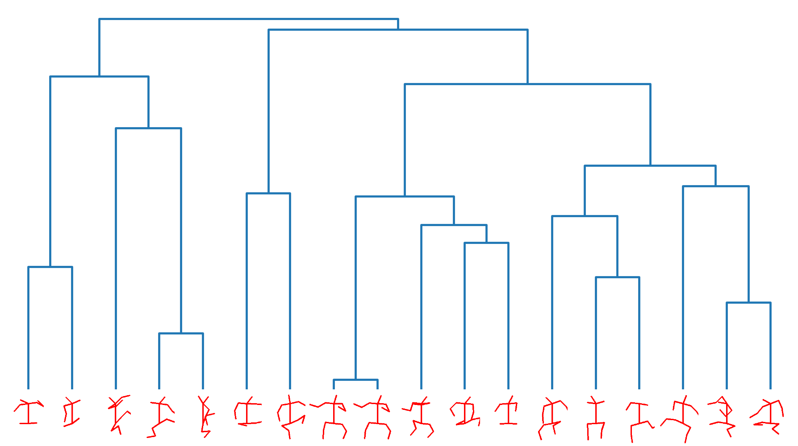
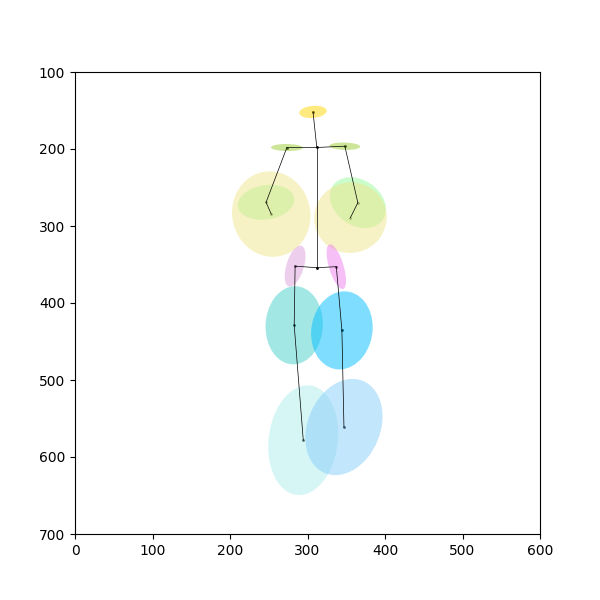

# Joints Data

The source keypoints data generated by `OpenPose` are in the folder `keypoints`, and the folder layout is as below:
* `keypoints/classical/[artist]/[painting_index]_keypoints.npy`
* `keypoints/modern/[artist]/[painting_index]_keypoints.npy`

All the following pose analysis is based on these source `OpenPose` keypoints data. 

For one pose, the analysis data include the following:
- [x] The angles between each joint, e.g., `joint_angles.csv`;
- [x] The normalized pose, e.g., `keypoints/classical/Michelangelo/1304_norm_1.png`;
- [ ] The length of each normalized limb.

For a group of poses, the analysis data include the following:
- [x] The dendrogram, e.g., `dendrogram-michelangelo.png`;
- [x] The elliptical clustering graph, e.g., `pose_std0.5_classical.png`;

In summary, the data generated in the following three code snippets are as below:
1. Angles between joints: `unit = rad`;
2. Lengths of limbs: `unit = pixel`;
3. The graphs, such as the normalized pose, the dendrogram, and the elliptical clustering graph.

## Normalize keypoints

Execute one of the following commands to generate the normalized pose:
* For all artists;
* For one artist, e.g., Michelangelo;
* For one painting of the chosen artist, e.g., Michelangelo's painting indexed as 1304.

```bash
python normalize_keypoints.py --input keypoints/
python normalize_keypoints.py --input keypoints/classical/Michelangelo/
python normalize_keypoints.py --input keypoints/classical/Michelangelo/1304_keypoints.npy
```

The example outputs are listed as below for one painting of Michelangelo:
* The normalized poses, e.g., in the folder `keypoints/classical/Michelangelo/1304_norm_1.png`;
* The angles between each joint, which is saved in the file `joint_angles.csv`.

<p float="left">
    
    
</p>

The length of the normalized limbs can be generated too!

## Hierachical clustering

Execute one of the following commands to generate the dendrogram:
* For all artists with the cluster size `10`;
* For one artist, e.g., Michelangelo, with the normalized poses shown below the dendrogram.

```bash
python hierarchical_clustering.py --cluster 10
python hierarchical_clustering.py --artist "Michelangelo" --pose True
```

The example output is listed as below for Michelangelo as input artist:
* The dendrogram, which is saved in the file `dendrogram-michelangelo.png`.

<p float="left">
    
</p>

## Elliptical clustering

Execute one of the following commands to generate the elliptical clustering graph:
* For the period `classical`;
* For the period `modern`.

```bash
python elliptical_distribution.py --period classical
python elliptical_distribution.py --period modern
```

The example output is listed as below for the period `classical`:
* The elliptical clustering graph, which is saved in the file `pose_std0.5_classical.png`.

<p float="left">
    
</p>
