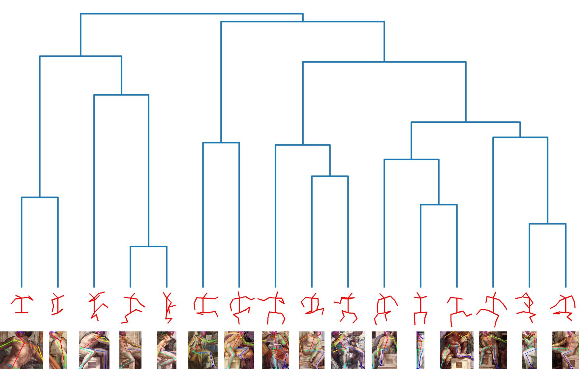
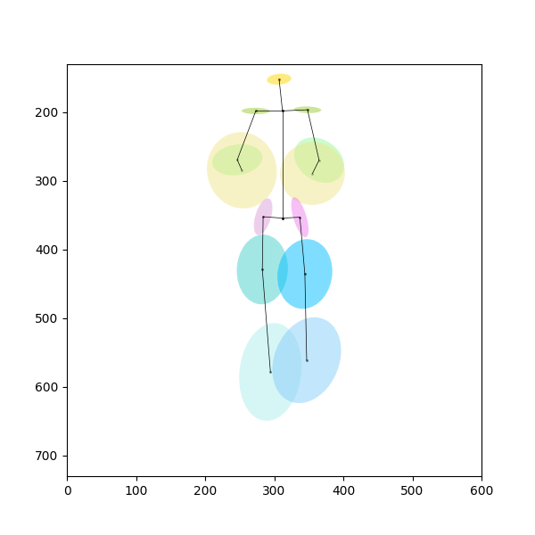
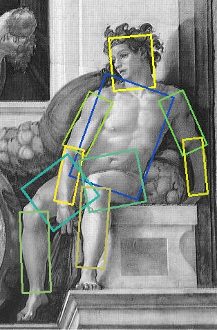
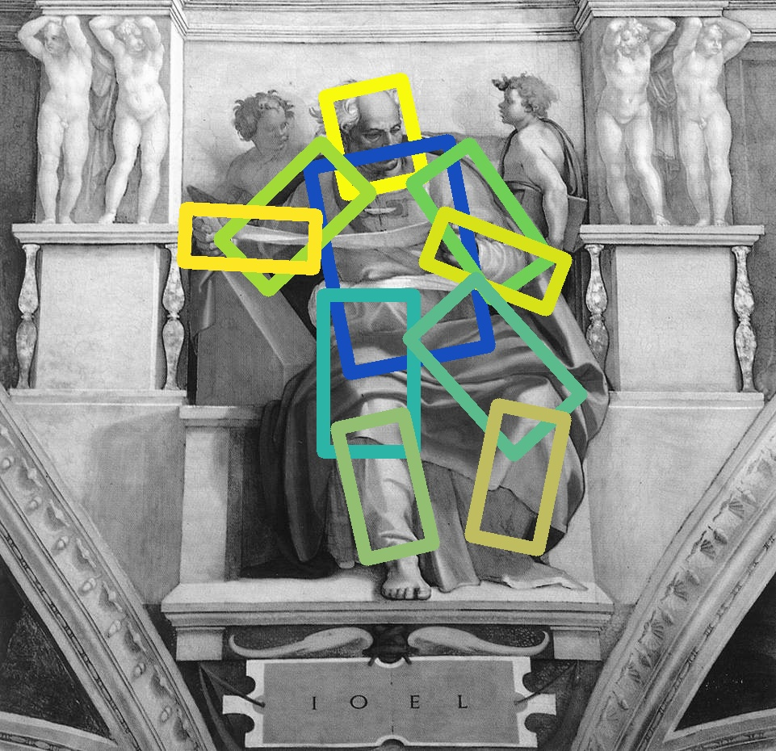
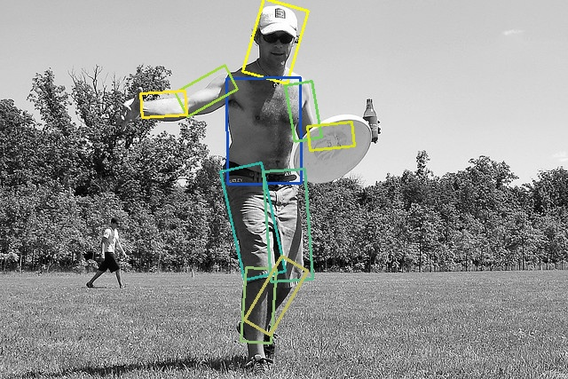

# Joints Data

The source keypoints data generated by `OpenPose` are in the folder `keypoints`, and the folder layout is as below:
* `keypoints/classical/[artist]/[painting_index]_keypoints.npy`
* `keypoints/modern/[artist]/[painting_index]_keypoints.npy`

All the following pose analysis is based on these source `OpenPose` keypoints data. 

For one pose, the analysis data include the following:
- [x] The angles between each joint, e.g., `joint_angles.csv`;
- [x] The normalized pose, e.g., `keypoints/classical/Michelangelo/1304_norm_1.png`;
- [ ] The length of each normalized limb.

For a group of poses, the analysis data include the following:
- [x] The dendrogram, e.g., `dendrogram-michelangelo.png`;
- [x] The elliptical clustering graph, e.g., `pose_std0.5_classical.png`;

In summary, the data generated in the following three code snippets are as below:
1. Angles between joints: `unit = rad`;
2. Lengths of limbs: `unit = pixel`;
3. The graphs, such as the normalized pose, the dendrogram, and the elliptical clustering graph.

## Normalize keypoints

Execute one of the following commands to generate the normalized pose:
* For all artists;
* For one artist, e.g., Michelangelo;
* For one painting of the chosen artist, e.g., Michelangelo's painting indexed as 1304.

```bash
python normalize_keypoints.py --input keypoints/
python normalize_keypoints.py --input keypoints/classical/Michelangelo/
python normalize_keypoints.py --input keypoints/classical/Michelangelo/1304_keypoints.npy
```

The example outputs are listed as below for one painting of Michelangelo:
* The normalized poses, e.g., in the folder `keypoints/classical/Michelangelo/1304_norm_1.png`;
* The angles between each joint, which is saved in the file `output/joint_angles.csv`.

<p float="left">
    
    
</p>

The length of the normalized limbs can be generated too!

## Hierachical clustering

Execute one of the following commands to generate the dendrogram:
* For all artists with the cluster size `10`;
* For one artist, e.g., Michelangelo, with the normalized poses shown below the dendrogram.

```bash
python hierarchical_clustering.py --cluster 10
python hierarchical_clustering.py --artist "Michelangelo" --pose True
```

The example output is listed as below for Michelangelo as input artist:
* The dendrogram, which is saved in the file `pix/dendrogram-michelangelo.png`.

<p float="left">
    
</p>

## Elliptical clustering

Execute one of the following commands to generate the elliptical clustering graph:
* For the period `classical`;
* For the period `modern`.

```bash
python elliptical_distribution.py --period classical
python elliptical_distribution.py --period modern
```

The example output is listed as below for the period `classical`:
* The elliptical clustering graph, which is saved in the file `pix/pose_std0.5_classical.png`.

<p float="left">
    
</p>

## Generate normalized segments by DensePose

Execute one of the following commands to generate the normalized segments:
* For one painting of one artist;
* For all the paintings of one artist.

```bash
python generate_rect_segm.py --input datasets/modern/Paul\ Delvaux/90551.jpg
python generate_rect_segm.py --input datasets/modern/Paul\ Delvaux
```

The example output is listed as below:
* The normalized segments with their widths and heights, which is saved in the file `output/norm_segm.csv`.

## Visualize normalized segments by DensePose

Execute the following command to visualize the normalized segments for one painting, which is based on `output/norm_segm.csv`:

```bash
python visualize_rect_segm.py --input datasets/modern/Paul\ Delvaux/90551.jpg
python visualize_rect_segm.py --input datasets/classical/Michelangelo/12758.jpg
```

The example outputs are listed as below for one painting of Paul Delvaux and Michelangelo respectively:

<p float="left">
    
    
</p>

## Generate average contour for normalized segments

Execute one of the following commands to generate and superimpose the average contour of `artist`, `man`, and `woman` on the normalized segments of the input painting, which is based on `output/norm_segm.csv`:
* Use the average contour of the artist `Michelangelo`;
* Use the average contour of the COCO men;
* Use the average contour of the COCO women.

```bash
python generate_avg_contour.py --input datasets/classical/Michelangelo/12758.jpg --contour artist
python generate_avg_contour.py --input datasets/classical/Michelangelo/12758.jpg --contour man
python generate_avg_contour.py --input datasets/modern/Paul\ Delvaux/90551.jpg --contour woman
```

The example outputs are listed as below for one painting of Michelangelo:
* The average contour of `Michelangelo`, which is saved in the file `output/contour.csv`;
* The average contour of `Michelangelo`, which is saved in the file `pix/avg_contour_Michelangelo.jpg`;
* The average contour superimposed on the norm segments of `Michelangelo`, which is saved in the file `pix/12758_on_avg_contour_Michelangelo.jpg`;
* The average contour of `Michelangelo` (on the right) superimposed on the normalized segments (on the left) for one of his paintings as below.

<p float="left">
    
    
</p>

## Visualize average contour superimposed on paintings

Execute the following command to superimpose the average contour of `Michelangelo` to one pose from one of his paintings, which is based on `output/contour.csv`:

```bash
python visualize_avg_contour_on_pose.py --input datasets/classical/Michelangelo/1304.jpg
```

The example output is listed as below for one painting of Michelangelo:
* The image is saved in the file `pix/Michelangelo_1304_avg_contour.jpg`.

<p float="left">
    
</p>

## Generate normalized segments for COCO people

Execute one of the following commands to generate the normalized segments for COCO `val2014` dataset `man` and `woman`:
* Generate the normalized segments for the COCO man;
* Generate the normalized segments for the COCO woman.

```bash
python generate_rect_segm_coco.py --gender man
python generate_rect_segm_coco.py --gender woman
```

The example output is listed as below:
* The normalized segments data for man, which is saved in the file `output/norm_segm_coco_man.csv`;
* The normalized segments data for woman, which is saved in the file `output/norm_segm_coco_woman.csv`;

## Visualize normalized segments for COCO people

Execute one of the following commands to visualize the normalized segments for COCO `val2014` dataset `man` and `woman`, given the image ID:
* Visualize the normalized segments for the COCO man;
* Visualize the normalized segments for the COCO woman.

```bash
python visualize_rect_segm_coco.py --image 25057 --gender man
python visualize_rect_segm_coco.py --image 54931 --gender woman
```

The example output is listed as below:
* The image is saved in the file `pix/54931_woman_norm.jpg`.

<p float="left">
    
    
</p>

## Visualize average contour superimposed on COCO people

Execute the following command to superimpose the average contour of `Paul Gauguin` (:art: magenta) to the COCO person, which is based on `output/contour.csv`:

```bash
python visualize_rect_segm_coco.py --image 54931 --gender woman --artist "Paul Gauguin"
```

The example outputs are listed as below for one COCO image `COCO_val2014_000000054931.jpg`:
* The image is saved in the file `pix/54931_woman_norm_with_Paul Gauguin_contour.jpg`;
* The coordinates of the vertices of all the rectangles (`contours`) for the normalized (`src`) and painter's average (`dst`) contours respectively, which are saved in the files `warp/54931_on_Paul Gauguin_src_boxes.npy` and `warp/54931_on_Paul Gauguin_dst_boxes.npy`, based on which the point `(src_x, src_y, dx, dy)` is calculated for further warping.

<p float="left">
    
</p>

## References

* https://github.com/facebookresearch/detectron2/pull/1974
* https://cocodataset.org/#download
* https://github.com/facebookresearch/detectron2/blob/main/projects/DensePose/doc/DENSEPOSE_DATASETS.md  
* https://github.com/facebookresearch/detectron2/blob/main/projects/DensePose/doc/DENSEPOSE_CSE.md
